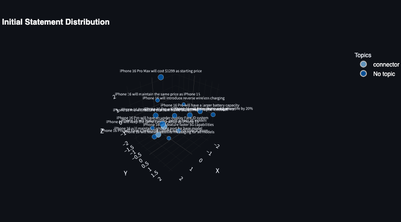
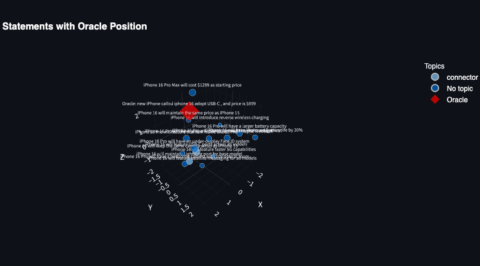
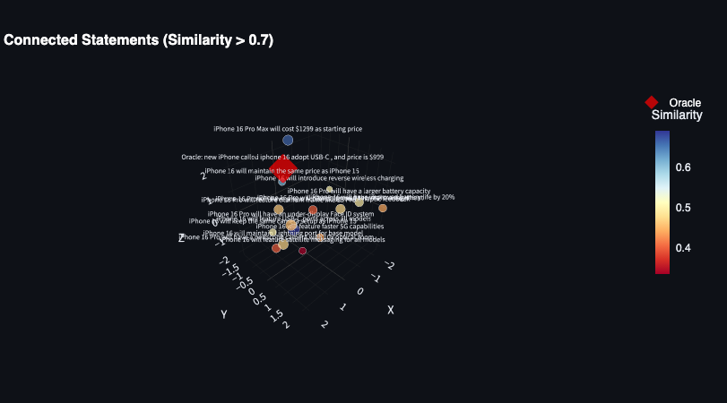

# Prophetdotfun

## About
- Shourt Summary: A platform for users to make prophecies and stake their own money in Natural Language like a twitter.


# Demo
## user experience
1. create prophecy


2. share prophecy


3. redeem or execute prophecy


---
## simulation
1. next iphone 16 people prediction in vector db


2. oracle sentence is set to "next iphone 16 people prediction"


3. transfer people's deposit token to the contract address by admin



# Description

■ Product Vision
Through a "system where users make prophecies about the future and stake their own money, which is then fairly evaluated by AI × Oracle", we aim to solve the waiting time and liquidity problems of traditional prediction markets.
User Value: An experience where users can take responsibility for their prophecies while getting real-time evaluation and NFT proof within the same theme.

■ User Stories (Epic)
Prophecy Posting User Story

User: General User / Future Prophet
Purpose: After connecting wallet, post prophecy (text, date, USDC, reference domain) and record as NFT (SBT)
Acceptance Criteria:
- Wallet connection can be done reliably
- After submitting information through prophecy input form, NFT issuance can be confirmed (on screen or blockchain)

Prophecy Settlement & Oracle Processing User Story

User: User wanting to realize prophecy
Purpose: Pay gas fee on Redeem page, reference mocked oracle (CNN/BBC/coincheck) data, execute settlement based on comparison results between prophecies of same theme
Acceptance Criteria:
- Oracle simulation can be called on Redeem page and settlement results displayed
- Comparison between prophecies of same theme (mock similarity search) is executed

■ Technical Specifications (Overview)
Frontend:
- Framework: React (or Next.js)
- UI Library: Material-UI / Tailwind CSS (emphasis on simple design)
- Wallet Integration: WalletConnect (MetaMask compatible)

Backend/Blockchain:
- Simple smart contract (NFT/SBT issuance on testnet)
- Oracle Simulation: Return fixed responses with dummy functions
- (Vectorization & Similar Prophecy Search): Display simple 2D/3D map (fixed sample data) on screen using mock data

External API:
- Whitelisted oracle information implemented with fixed values or simple API simulation

■ MVP (Minimum Viable Product) Features
Prophecy Page:
- Wallet connection
- Prophecy input form (title, text, target date, USDC, reference domain)
- NFT (SBT) issuance after submission (screen display or blockchain transaction)

Redeem Page:
- Oracle call simulation (dummy data)
- Similar prophecy search within same theme (mock implementation)
- Settlement process simulation (result display & fund movement image)


---

# Sequence Diagram

## Prophet Create

```
sequenceDiagram
    participant U as User
    participant FE as Frontend
    participant WC as Wallet (MetaMask/WalletConnect)
    participant SC as Smart Contract
    participant BC as Blockchain
    participant VDB as Vector DB

    U->>FE: Request wallet connection
    FE->>WC: Send connection request
    WC-->>FE: Connection success
    FE->>U: Display wallet connection complete

    U->>FE: Input prophecy form information\n(title, text, target date, USDC, reference domain)
    FE->>SC: Call createProphet() (with input info as args)
    SC->>BC: Start NFT (SBT) issuance transaction
    BC-->>SC: Transaction complete (confirmation)
    SC-->>FE: Return issued NFT info (tokenId, txHash)

    FE->>FE: Calculate vector & generate hash from prophecy text
    FE->>VDB: Register vector, hash, tokenId etc.
    VDB-->>FE: Registration complete notification

    FE->>U: Display NFT issuance & recording complete
```

## Prophet Redeem

```sequenceDiagram
    participant U as User
    participant FE as Frontend (Redeem page)
    participant OS as Oracle Simulator
    participant VDB as Vector DB
    participant SC as Smart Contract
    participant BC as Blockchain

    U->>FE: Click "Redeem" button (start realization)
    FE->>U: Display gas fee payment prompt
    U->>FE: Confirm gas fee payment
    FE->>OS: Call oracle simulation
    OS-->>FE: Return fixed response\n(e.g. CNN/BBC/coincheck data)

    FE->>VDB: Similar prophecy search request\n(cosine similarity calculation + hash verification)
    VDB-->>FE: Return similar prophecy data

    FE->>SC: Call redeemProphet()\n(attach oracle & similar search results)
    SC->>BC: Execute settlement transaction (fund movement simulation)
    BC-->>SC: Transaction confirmation
    SC-->>FE: Return settlement process result

    FE->>U: Display settlement result & updated information
```
